# SmartCook

SmartCook is an intelligent cross-platform mobile application developed with **Flutter**.
It helps users manage their food inventory, generate personalized recipes using available ingredients, scan food products, interact with an AI-powered cooking assistant, and organize shopping lists.

The application combines **Artificial Intelligence**, **barcode scanning**, **REST APIs**, and **cloud technologies** to simplify meal preparation while reducing food waste.
It is powered by a secure **Node.js/Express** backend connected to a **MySQL** database.

---

## Table of Contents

- [Application Preview](#application-preview)
- [Project Overview](#project-overview)
- [Features](#features)
- [Technologies Used](#technologies-used)
- [Project Architecture](#project-architecture)
- [Prerequisites](#prerequisites)
- [Clone the Repository](#clone-the-repository)
- [Run the Flutter App](#run-the-flutter-app)
- [Backend Setup](#backend-setup)
- [API Configuration](#api-configuration)
- [Main API Routes](#main-api-routes)
- [Main Screens](#main-screens)
- [Environment Variables](#environment-variables)
- [Future Improvements](#future-improvements)
- [Author](#author)
- [License](#license)

---

## Application Preview

All important application screenshots are stored in the `screenshots/` folder.

### Authentication

<p align="center">
  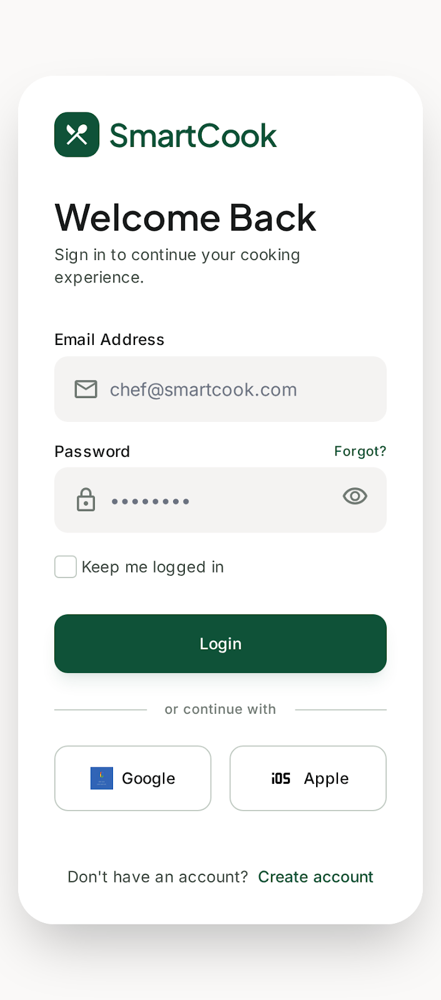
  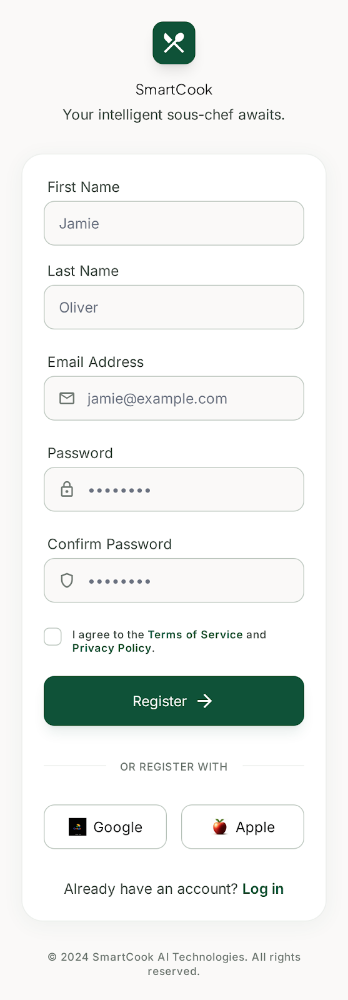
  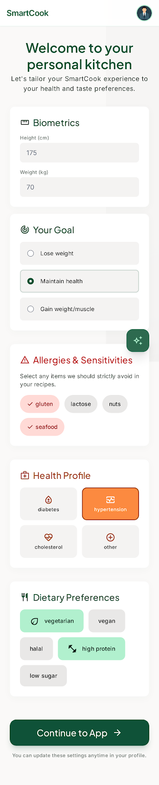
</p>

### Home and Inventory

<p align="center">
  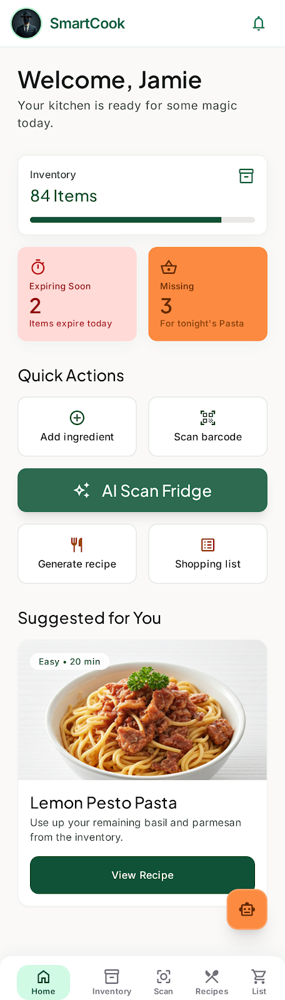
  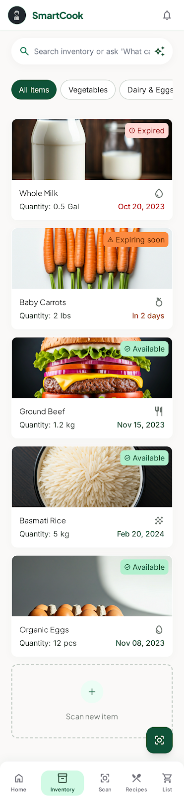
  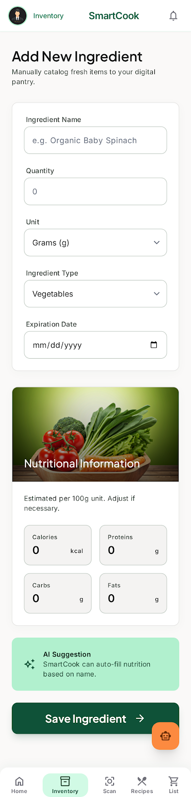
</p>

### Scan and AI Features

<p align="center">
  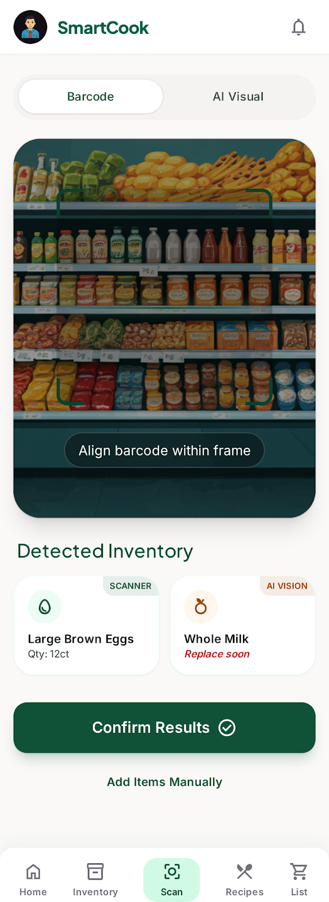
  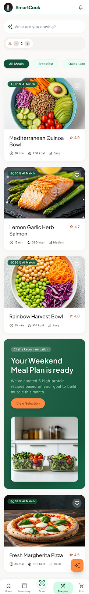
  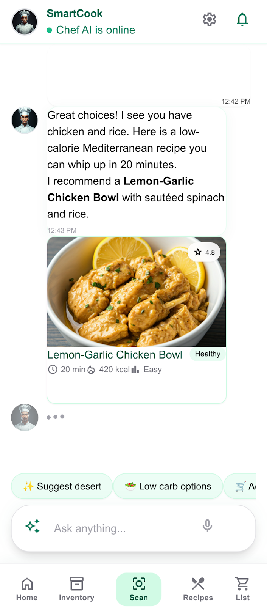
</p>

### Recipe, Shopping and Details

<p align="center">
  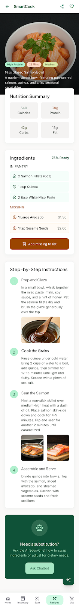
  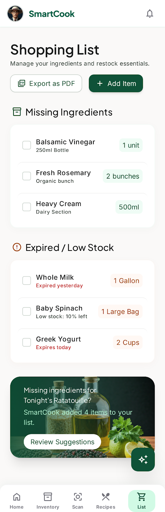
</p>

---

## Project Overview

SmartCook is designed to help users make the most of the ingredients they already have at home.
Instead of searching manually for recipes or buying unnecessary groceries, users can organize their food inventory and receive personalized recipe recommendations generated by Artificial Intelligence.

The application integrates modern mobile technologies, cloud services, barcode scanning, RESTful APIs, and generative AI to provide a complete and intuitive cooking experience.

---

## Features

### Authentication

- User registration
- Secure login
- JWT authentication
- Password encryption using bcrypt
- Session persistence

### User Profile

- User profile setup
- Personal information management
- Dietary preferences
- Cooking preferences

### Food Inventory

- Add ingredients
- Edit ingredients
- Remove ingredients
- Organize available food products
- Manage ingredient data through the backend API

### Barcode Scanner

- Scan food product barcodes
- Retrieve product information
- Add scanned products to the inventory

### AI Features

- AI-powered recipe generation
- AI cooking assistant chatbot
- Food and ingredient recognition support
- Cooking questions and suggestions
- Ingredient substitution ideas

### Recipe Management

- Generate recipes from available ingredients
- Display recipe results
- Show recipe details
- Display preparation instructions
- Suggest missing ingredients
- Estimate cooking time and servings

### Shopping List

- Create shopping lists
- Add products
- Remove products
- Mark purchased items

### PDF Export

- Export recipes
- Export shopping lists
- Generate printable documents

### Local Storage

- Store session data locally
- Use Shared Preferences for persistence

### REST API

- Secure frontend-backend communication
- Authentication endpoints
- Inventory management
- Recipe generation
- Shopping list management
- AI services integration

---

## Technologies Used

### Mobile Application

- Flutter
- Dart
- Provider
- HTTP
- Mobile Scanner
- Shared Preferences
- Cached Network Image
- PDF
- Printing

### Backend

- Node.js
- Express.js
- MySQL
- JWT
- bcryptjs
- dotenv
- Axios
- CORS
- Google Gemini AI

### Deployment and Cloud

- Railway
- REST API
- Cloud backend support

---

## Project Architecture

```text
smartcook/
|
├── lib/
│   ├── models/
│   │   ├── aliment_model.dart
│   │   ├── ingredient_model.dart
│   │   ├── profile_model.dart
│   │   ├── recipe_model.dart
│   │   ├── shopping_item_model.dart
│   │   └── user_model.dart
│   │
│   ├── providers/
│   │   ├── auth_provider.dart
│   │   ├── ingredient_provider.dart
│   │   ├── recipe_provider.dart
│   │   └── shopping_provider.dart
│   │
│   ├── screens/
│   │   ├── add_ingredient_screen.dart
│   │   ├── ai_scan_screen.dart
│   │   ├── barcode_scan_screen.dart
│   │   ├── chatbot_screen.dart
│   │   ├── generate_recipe_screen.dart
│   │   ├── home_screen.dart
│   │   ├── initial_profile_screen.dart
│   │   ├── inventory_screen.dart
│   │   ├── login_screen.dart
│   │   ├── profile_screen.dart
│   │   ├── recipe_detail_screen.dart
│   │   ├── recipe_results_screen.dart
│   │   ├── register_screen.dart
│   │   └── shopping_list_screen.dart
│   │
│   ├── services/
│   │   ├── api_service.dart
│   │   ├── auth_service.dart
│   │   ├── chatbot_service.dart
│   │   ├── image_service.dart
│   │   ├── ingredient_service.dart
│   │   ├── pdf_service.dart
│   │   ├── recipe_service.dart
│   │   └── storage_service.dart
│   │
│   ├── utils/
│   │   ├── api_constants.dart
│   │   └── validators.dart
│   │
│   └── widgets/
│       ├── custom_app_bar.dart
│       ├── custom_bottom_nav_bar.dart
│       ├── custom_button.dart
│       ├── custom_text_field.dart
│       ├── ingredient_card.dart
│       ├── loading_widget.dart
│       └── recipe_card.dart
│
├── assets/
│   └── images/
│
├── screenshots/
│   ├── add_ingredient.png
│   ├── ai_recepies.png
│   ├── chat_boot.png
│   ├── home.png
│   ├── inventory.png
│   ├── login.png
│   ├── recipe_details.png
│   ├── Register2.png
│   ├── Registrer1.png
│   ├── scan.png
│   └── shoppingList.png
│
├── android/
├── ios/
├── linux/
├── macos/
├── windows/
├── web/
│
├── smartcook_backend/
│   ├── config/
│   │   ├── api_config.dart
│   │   └── db.js
│   ├── controllers/
│   ├── middleware/
│   ├── models/
│   ├── routes/
│   │   ├── alimentRoutes.js
│   │   ├── authRoutes.js
│   │   ├── chatRoutes.js
│   │   ├── inventoryRoutes.js
│   │   ├── recipeRoutes.js
│   │   ├── shoppingRoutes.js
│   │   └── userRoutes.js
│   ├── services/
│   ├── utils/
│   ├── app.js
│   ├── server.js
│   └── package.json
│
├── pubspec.yaml
├── package.json
└── README.md
```

---

## Prerequisites

Before running the project, install:

- Flutter SDK
- Dart SDK
- Node.js
- npm
- MySQL
- Android Studio or Visual Studio Code
- Android emulator or physical Android device

Check Flutter installation:

```bash
flutter doctor
```

---

## Clone the Repository

```bash
git clone https://github.com/your-username/smartcook.git
cd smartcook
```

Replace `your-username` with your GitHub username.

---

## Run the Flutter App

Install Flutter dependencies:

```bash
flutter pub get
```

Run the application:

```bash
flutter run
```

Run on Chrome:

```bash
flutter run -d chrome
```

Run on a connected Android device:

```bash
flutter devices
flutter run
```

---

## Backend Setup

Go to the backend folder:

```bash
cd smartcook_backend
```

Install backend dependencies:

```bash
npm install
```

Create a `.env` file inside `smartcook_backend/`:

```env
PORT=3000
DB_HOST=localhost
DB_USER=root
DB_PASSWORD=your_mysql_password
DB_NAME=smartcook
JWT_SECRET=your_jwt_secret
GEMINI_API_KEY=your_gemini_api_key
```

Start the backend server:

```bash
npm start
```

The backend server will run on:

```text
http://localhost:3000
```

The API base URL will be:

```text
http://localhost:3000/api
```

To test the backend in the browser:

```text
http://localhost:3000
```

To test database connection:

```text
http://localhost:3000/test-db
```

---

## API Configuration

The API base URL is configured in:

```text
lib/utils/api_constants.dart
```

Current configuration:

```dart
static const String baseUrl = kIsWeb
    ? 'http://localhost:3000/api'
    : 'https://smartcook-production.up.railway.app/api';
```

This means:

- Web app uses the local backend: `http://localhost:3000/api`
- Installed mobile app uses the deployed Railway backend: `https://smartcook-production.up.railway.app/api`

If you want to use the local backend on a real Android device, replace `localhost` with your computer local IP address.

Example:

```dart
static const String baseUrl = 'http://192.168.1.10:3000/api';
```

---

## Main API Routes

```text
/api/auth
/api/user
/api/inventory
/api/recipes
/api/shopping
/api/chat
/api/chatbot
/api/aliments
```

---

## Main Screens

| Screen | Description |
| ------ | ----------- |
| LoginScreen | User login |
| RegisterScreen | User registration |
| InitialProfileScreen | Initial user profile setup |
| HomeScreen | Main home page |
| InventoryScreen | Food inventory management |
| AddIngredientScreen | Add a new ingredient |
| BarcodeScanScreen | Scan product barcode |
| AiScanScreen | AI food scanning |
| ChatbotScreen | AI cooking assistant |
| GenerateRecipeScreen | Generate recipes |
| RecipeResultsScreen | Display generated recipes |
| RecipeDetailScreen | Recipe details |
| ShoppingListScreen | Shopping list management |
| ProfileScreen | User profile |

---

## Main Models

| Model | Description |
| ----- | ----------- |
| User | User account information |
| Profile | User preferences and profile data |
| Ingredient | Inventory ingredient |
| Aliment | Food product information |
| Recipe | Recipe information |
| ShoppingItem | Shopping list item |

---

## Environment Variables

| Variable | Description |
| -------- | ----------- |
| PORT | Backend server port |
| DB_HOST | MySQL host |
| DB_USER | MySQL username |
| DB_PASSWORD | MySQL password |
| DB_NAME | MySQL database name |
| JWT_SECRET | Secret key for JWT authentication |
| GEMINI_API_KEY | Google Gemini API key |

---

## Future Improvements

- Favorite recipes
- Recipe history
- Ingredient expiration notifications
- Offline mode
- Meal planner
- Nutrition analysis
- Voice assistant
- Multi-language support
- Cloud synchronization
- Administrator dashboard
- Push notifications
- Advanced search filters

---

## Project Objective

This project was developed as part of an academic mobile development project.
Its main objective is to provide a modern, practical, and intelligent cooking assistant that helps users cook with available ingredients, reduce food waste, and organize their meals more efficiently.

---

## License

This project was developed as part of an academic project.
